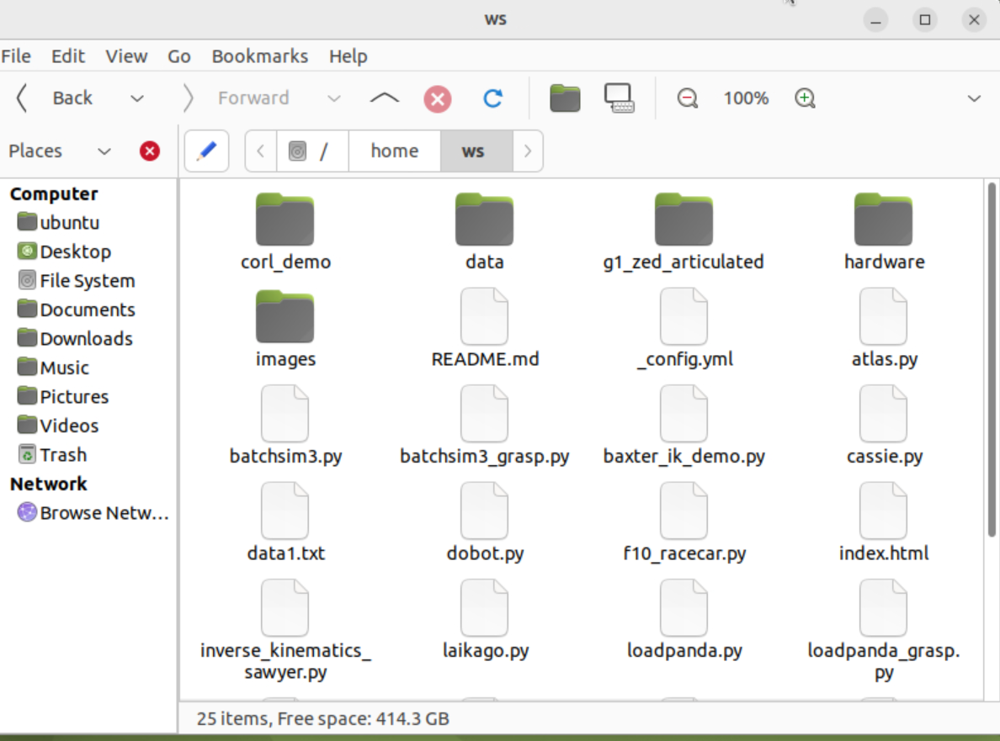
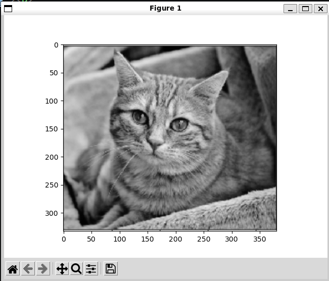

## Week 10：Docker 概念与 OpenCV 实验  
Docker 基础概念  
Image 镜像  
只读的模板，包含了运行应用程序所需的所有文件、依赖项、配置、库和运行环境。可以将其理解为轻量级的、可执行的"安装包"，用于在 Docker 容器中运行代码，确保应用程序在不同环境中保持一致性。  
Docker 基础指令
# 拉取镜像
docker pull <镜像名>

# 运行容器
docker run <镜像名>

# 查看运行中的容器
docker ps

# 查看所有容器（包括已停止的）
docker ps -a

# 停止容器
docker stop <容器ID>

# 删除容器/其他资源
docker rm <容器ID>

# 删除镜像
docker rmi <镜像ID>

# 构建镜像
docker build .

# 保存容器为新镜像
docker commit <容器ID> <新镜像名>
容器与本地文件交互
使用 -v 进行本地目录挂载
docker run 命令首先在指定的镜像上创建一个可写的容器层，然后使用指定的命令启动。

使用参数 -v 允许你绑定一个本地目录：

docker run -p 6080:80 --security-opt seccomp=unconfined --shm-size=512m \
  -v "$(pwd)/:/home/ws" \
  ghcr.io/tiryoh/ros2-desktop-vnc:humble  
  
安装 OpenCV
# 基础安装
pip install opencv-python opencv-contrib-python

# Ubuntu 24 安装
pip3 install opencv-python opencv-contrib-python --break-system-packages

# 如果出现 numpy 版本问题
pip install "numpy<2"
OpenCV 基本使用
import cv2
import matplotlib.pyplot as plt

# 读取图像（彩色）
img_basic = cv2.imread('cat.jpg', cv2.IMREAD_COLOR)

# 显示图像（注意 OpenCV 使用 BGR，需要转换为 RGB）
plt.imshow(cv2.cvtColor(img_basic, cv2.COLOR_BGR2RGB))
plt.show()

# 转换为灰度图像
img_basic = cv2.cvtColor(img_basic, cv2.COLOR_BGR2GRAY)

# 显示灰度图像
plt.imshow(cv2.cvtColor(img_basic, cv2.COLOR_GRAY2RGB))
plt.show()  
