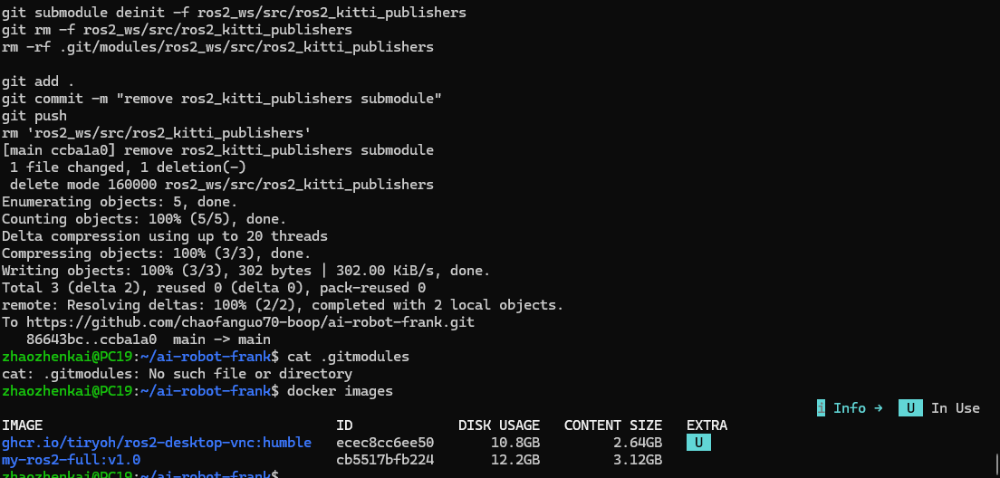
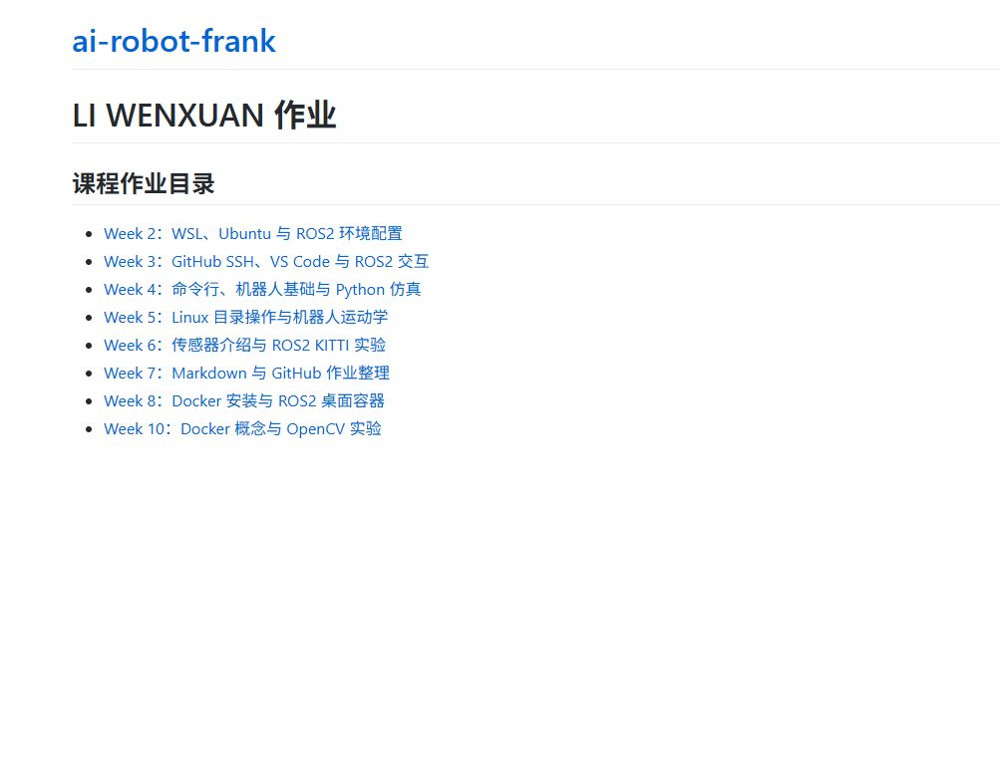

## Week 11：Docker 进阶与 GitHub Pages 网页部署  
Docker 进阶操作  
获得 Docker 容器 ID  
查看正在运行的容器： docker ps  
查看所有容器（包括已停止的）： docker ps -a  
停止 Docker 容器  
示例： docker stop abc123  
Docker 镜像更新保存  
如果在 Docker 镜像中进行了系统程序安装，需要保存安装的环境时：  

docker commit -m "更新描述" -a "作者" <容器ID> <新镜像名>:<标签> 示例：  

在容器中安装了 opencv 和 pybullet 后保存 docker commit -m "install opencv and pybullet" -a "myname" abc123 my-ros2-env:v1.0  
查看保存的镜像： docker images  

## 课堂任务 2：将 GitHub 作业仓库转为网页  
步骤 1：开启 GitHub Pages  
1.打开你的 GitHub 作业仓库页面 点击仓库顶部的 Settings（设置）  
2.在左侧菜单中找到并点击 Pages  

在 "Source" 部分，选择：  

Source（源）：Deploy from a branch Branch（分支）：main（或 master） Folder（文件夹）：/ (root) 点击 Save（保存）  

等待约 1-3 分钟，页面会显示： Your site is live at https://<你的用户名>.github.io/<仓库名>/  
