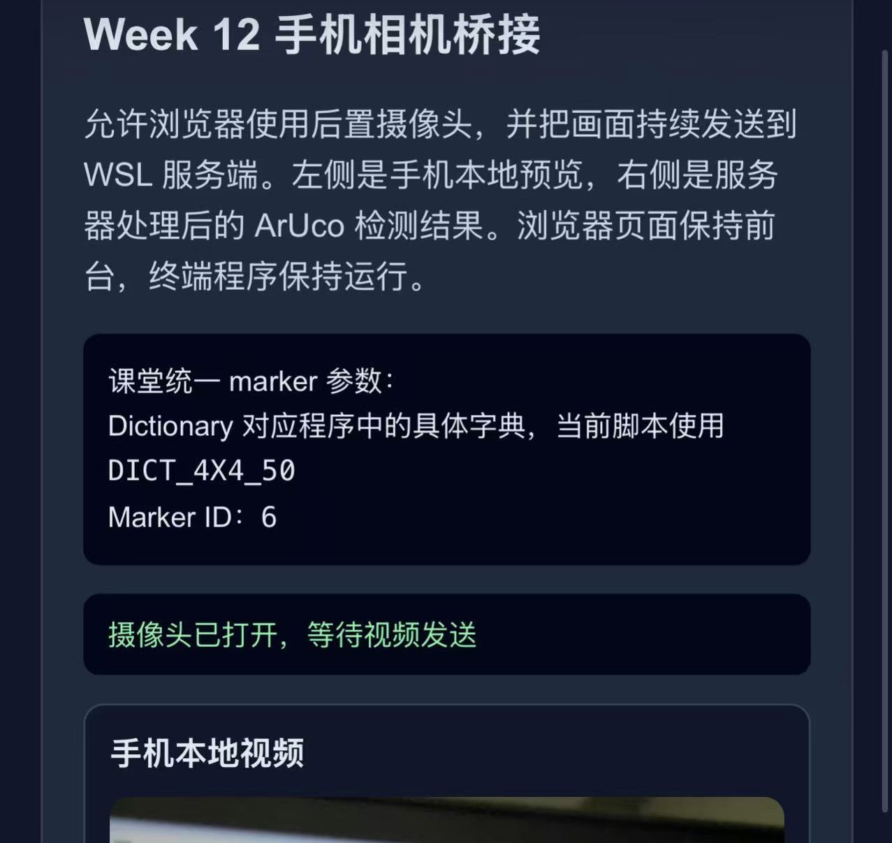

## 第12周：手机摄像头、ArUco 识别与距离测量  
# 第一部分：将手机摄像头作为输入，连入 WSL 系统  
1.在 WSL 中命令行安装 Tailscale  
在开始 WSL 端安装之前，手机端也要先做一个很简短的准备：  

iPhone / iPad：在 App Store 安装 Tailscale  
Android：在应用商店安装 Tailscale  
手机端登录时，使用和电脑端 同一个账号  
第一次打开时允许 VPN 或网络扩展权限  
手机端这一步不需要复杂配置，先保证两件事即可：  

手机上已经安装并登录 Tailscale : 
后面能和 WSL 出现在同一个 Tailnet 中  
本课程统一使用 WSL 命令行 安装，不依赖图形界面。  

curl -fsSL https://tailscale.com/install.sh | sh  
sudo service tailscaled start  
sudo tailscale up  
执行 sudo tailscale up 后，按照终端提示登录自己的账号。   

这里登录的账号应当与手机端保持一致。  

查看当前网络状态：  

tailscale status  
tailscale ip -4  
2.加上 SSH 登录学习测试  
既然手机和 WSL 已经通过 Tailscale 进入同一个虚拟网络，本周可以顺手做一个很有工程味的验证：  

除了“拉视频流”，这个网络还能不能让我们对 WSL 进行远程登录？  

这一步的目的不是让手机作为主要开发终端，而是让大家理解：  

Tailscale 不只是给摄像头用  
它本质上是在打通设备与设备之间的网络连接  
打通之后，视频流、SSH、HTTP 服务都可以复用这条链路  
先在 WSL 里安装 SSH 服务：  

sudo apt update  
sudo apt install openssh-server -y  
sudo service ssh start  
确认 SSH 服务正在监听：  

sudo service ssh status  
ss -tlnp | grep :22  
然后查看 WSL 在 Tailscale 中的地址：  

tailscale ip -4  
