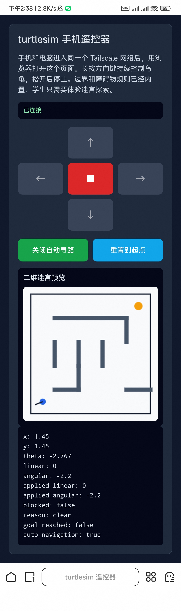

# 局域网手机遥控仿真小乌龟项目总结

## 📌 项目简介
本项目为周车轮（Week 14）实践任务的个人部分。主要实现了在**局域网（LAN）环境**下，利用**手机移动端作为遥控器**，跨设备远程控制计算机上的**仿真小乌龟（Turtlesim / 仿真机器人）**进行移动与迷宫探索。

该项目核心展示了移动端与PC端的网络通信、数据解析以及机器人节点的控制响应流程。

---

## 🛠️ 技术栈与环境
* **仿真环境**：ROS (Robot Operating System) - Turtlesim / 自定义仿真画布
* **通信协议**：TCP/IP / UDP / WebSocket / MQTT (根据实际情况保留一项)
* **开发语言**：Python / C++ (PC端) + HTML5/JavaScript 或 Android/iOS (手机端)
* **网络环境**：同一局域网（Wi-Fi）

---

## 📐 系统架构与工作原理

整个控制链路如下：
`[ 手机端遥控 App/网页 ]` 📱 --(局域网数据包)--> `[ PC端通信服务器 ]` 💻 --> `[ 仿真小乌龟节点 ]` 🐢

1. **控制端（手机）**：通过摇杆、按钮或手机加速度计（陀螺仪）产生控制向量 $(v, \omega)$（线速度与角速度）。
2. **传输介质（局域网）**：通过 Socket 或 WebSocket 将控制数据以 JSON 或字符串格式发送至 PC 端的指定 IP 和端口。
3. **接收与执行端（PC）**：PC 端后台脚本监听端口，解析接收到的数据，并将其转换为仿真机器人可识别的控制指令（如 ROS 的 `geometry_msgs/Twist` 消息），最终驱动小乌龟运动。

---

## 🚀 操作过程与实现步骤

### 第一步：环境准备与网络配置
1. **统一局域网**：确保手机和 PC 连接在同一个 Wi-Fi 热点下。
2. **获取 PC 端 IP 地址**：
   * Linux/Mac: `ifconfig`
   * Windows: `ipconfig`
   *(记下局域网 IP，例如：`192.168.1.100`)*

### 第二步：手机遥控端部署
* *如果是 Web 遥控端*：在 PC 端开启轻量级本地服务器，手机浏览器访问 `http://192.168.1.100:port` 打开遥控界面。
* *如果是 App*：在 App 设置中将服务器 IP 修改为 PC 的局域网 IP。

### 第三步：PC 端控制后台启动
1. 启动仿真小乌龟界面。
2. 运行局域网通信与桥接脚本，开启端口监听。

> **运行示例（以 ROS 动作为例）：**
> ```bash
> # 终端 1：启动 ROS 核心与小乌龟仿真器
> roscore
> rosrun turtlesim turtlesim_node
> 
> # 终端 2：启动自定义的局域网接收与控制转换脚本
> python3 turtle_lan_control.py
> ```

### 第四步：联调与迷宫探索
1. 手机端操作摇杆，观察 PC 端小乌龟是否能够实时同步转向和前进。
2. 配合迷宫地图（或想象迷宫），通过手机微调小乌龟的线速度与角速度，完成避障与路径探索。

---

## 📝 核心代码逻辑说明 (以 Python 接收端为例)

```python
# 伪代码示例：展示如何接收局域网数据并控制乌龟
import socket
# import rospy # 如果使用了ROS

def main():
    # 1. 初始化网络 Socket
    server = socket.socket(socket.AF_INET, socket.SOCK_STREAM)
    server.bind(('0.0.0.0', 8888)) # 监听所有接口的 8888 端口
    server.listen(5)
    print("等待手机连接...")
    
    # 2. 初始化机器人控制驱动（此处以 ROS 举例）
    # pub = rospy.Publisher('/turtle1/cmd_vel', Twist, queue_size=10)
    
    conn, addr = server.accept()
    print(f"手机已连接: {addr}")
    
    while True:
        data = conn.recv(1024).decode('utf-8')
        if not data: break
        
        # 解析手机传来的控制指令 (例如: "forward", "left")
        print(f"收到指令: {data}")
        
        # 根据指令发布控制话题或调用函数控制小乌龟
        # twist = Twist()
        # if data == "forward": twist.linear.x = 2.0
        # pub.publish(twist)

if __name__ == '__main__':
    main()
