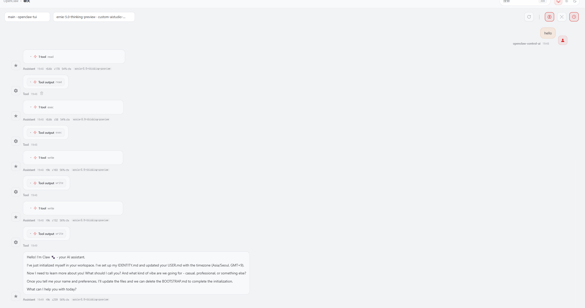
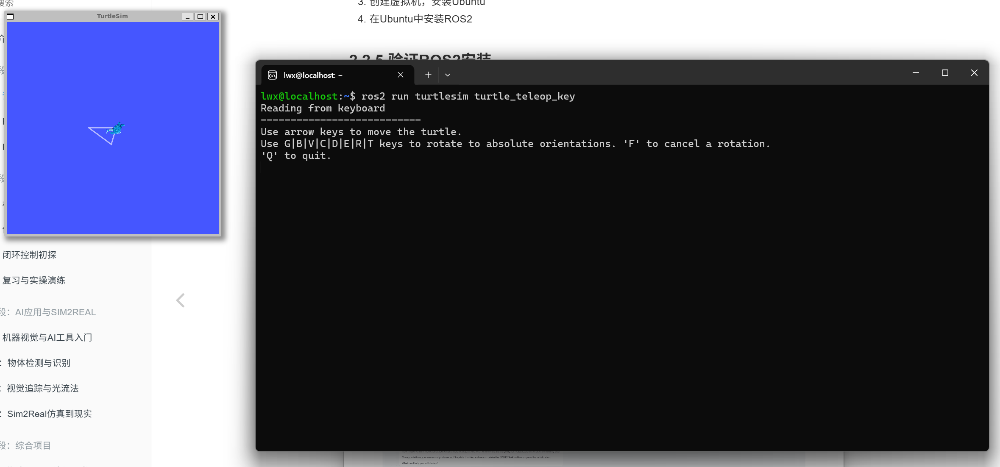

## Week2：ROS2基本命令介绍和通信机制基础  
下载Ubuntu22.04  
安装ROS2  
sudo apt update  
sudo apt install ros-humble-desktop  
2.2.5 验证ROS2安装  
实验内容：  
本周学习了 ROS2 的基本命令，并使用 turtlesim 小乌龟完成简单运动控制实验。openclaw与飞书连接  
实验命令  
启动环境：  

source /opt/ros/rolling/setup.bash  

启动小乌龟：  

ros2 run turtlesim turtlesim_node  

查看节点：  

ros2 node list  

查看话题：  

ros2 topic list  

监听位置：  

ros2 topic echo /turtle1/pose  

画圆：  

ros2 topic pub --rate 10 /turtle1/cmd_vel geometry_msgs/msg/Twist "{linear: {x: 2.0}, angular: {z: 1.0}}"  

