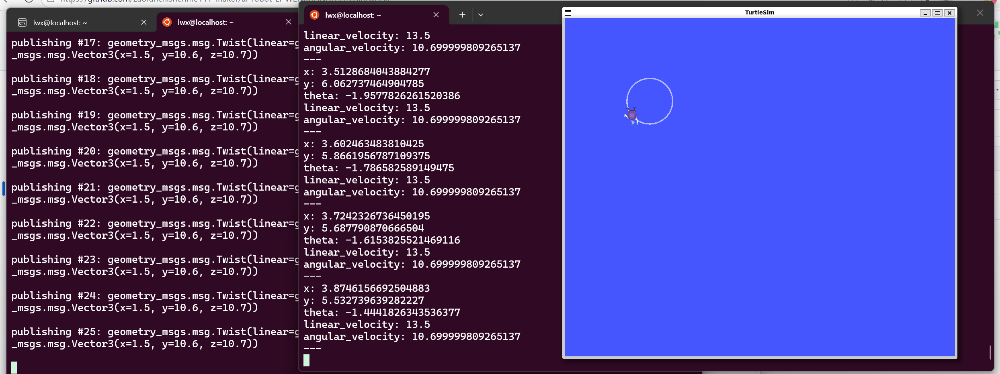

## ROS2基本命令  
查看节点
# 列出所有运行中的节点  
ros2 node list  

# 查看节点信息  
ros2 node info /节点名称  
示例：  

$ ros2 node list  
/turtlesim  
/teleop_turtle  
运行节点  
# 运行一个包中的节点  
ros2 run <包名> <节点名>

# 示例：运行小乌龟
ros2 run turtlesim turtlesim_node
ros2 run turtlesim turtle_teleop_key  
查看话题
# 列出所有话题
ros2 topic list

# 查看话题信息
ros2 topic info /话题名称

# 查看话题消息类型
ros2 topic type /话题名称
发布话题
# 发布消息到话题
ros2 topic pub <话题名> <消息类型> "<数据>"

# 示例：让小乌龟前进
ros2 topic pub /turtle1/cmd_vel geometry_msgs/msg/Twist "{linear: {x: 1.0, y: 0.0, z: 0.0}, angular: {x: 0.0, y: 0.0, z: 0.0}}"  
监听话题
监听话题消息
ros2 topic echo <话题名>

示例：监听小乌龟位置
ros2 topic echo /turtle1/pose  
