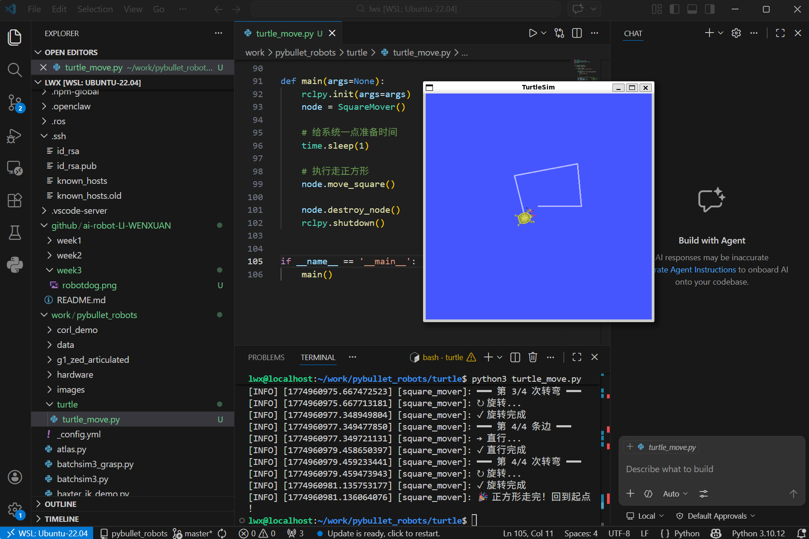
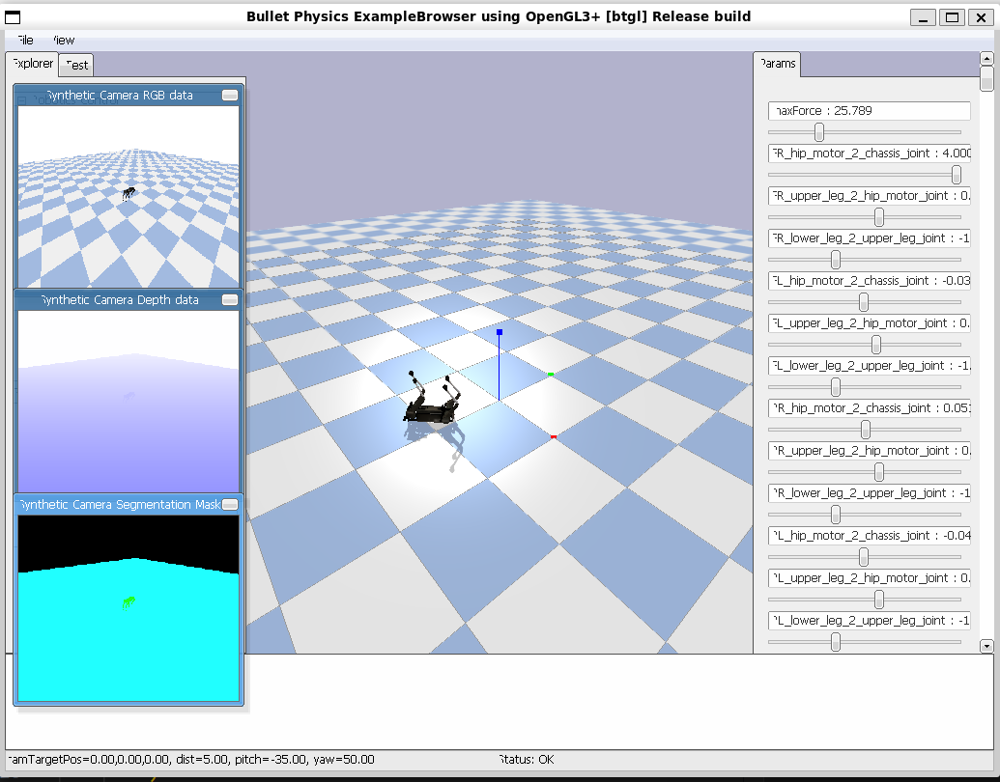

## 小乌龟走正方形原理  
#!/usr/bin/env python3 """ 让小乌龟走正方形的控制脚本 """

import rclpy from rclpy.node import Node from geometry_msgs.msg import Twist import time

class SquareMover(Node): """走正方形的控制节点"""  
  
## 机器狗放倒  
python安装和python程序的命令行执行  
sudo apt install python  
cd 程序所在目录  
python3 程序名字.py (有时候需要用python)  
python 的包管理器 pip (有时候需要使用pip3) 安装  
sudo apt install python3-pip  
pip3 install pybullet 安装仿真用的物理引擎库  
运行机器狗仿真程序  
#git clone https://github.com/bulletphysics/pybullet_robots  
#python3 lakago.py  
运行程序，改关节参数，放（倒）狗（子）  
  