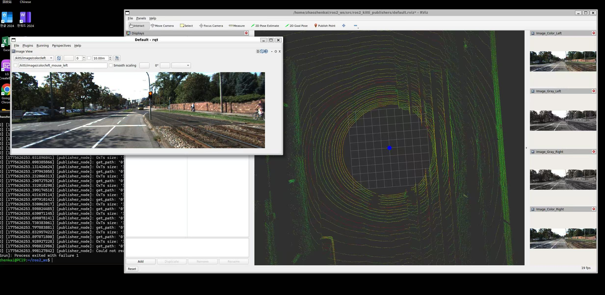

## week6 ROS2 Kitti 数据集发布器  
这是一个示例 ROS2 发布器应用程序，用于将 Kitti 数据集转换并发布为 ROS2 消息。 发布的消息主要包括 PointCloud2（点云）、Image（图像）、Imu（惯性测量单元）和 MarkerArray（标记阵列）。  

mkdir -p ~/ros2_ws/src  

cd ~/ros2_ws/src  

git clone https://github.com/ai-robot-class/ros2_kitti_publishers.git  

Kitti 示例数据地址 https://drive.google.com/file/d/1lCOOkoUp1RRrFhUwRVNVwRWIclv-etBu/view?usp=drive_link  

