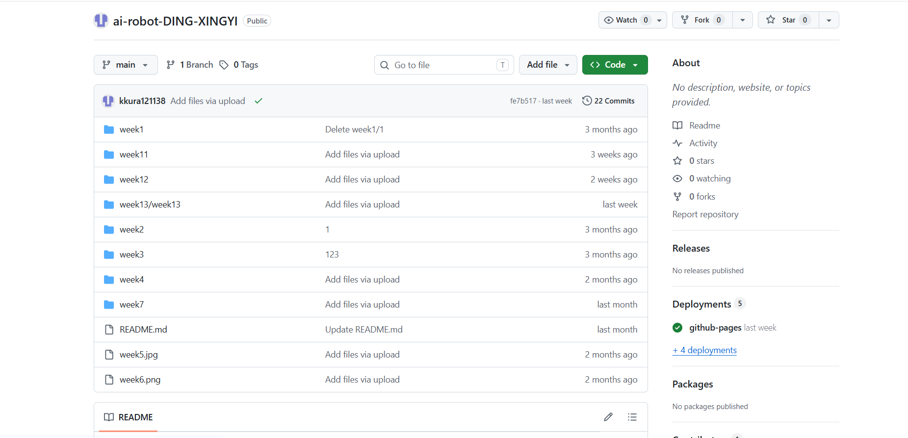

## 第7周：复习与实操演练  
练习1：ROS2命令
# 1. 启动Turtlesim节点
ros2 run turtlesim turtlesim_node

# 2. 查看所有运行中的节点
ros2 node list

# 3. 查看所有话题
ros2 topic list

# 4. 发布速度命令让小乌龟前进
ros2 topic pub /turtle1/cmd_vel geometry_msgs/Twist "{linear: {x: 1.0, y: 0.0, z: 0.0}, angular: {x: 0.0, y: 0.0, z: 0.0}}"

# 5. 监听位置话题
ros2 topic echo /turtle1/pose
练习2：Python编程
# 题目：编写一个节点，让机器人走正方形
# 边长：2米，速度：1m/s

# 参考答案：
import rclpy
from rclpy.node import Node
from geometry_msgs.msg import Twist
import time

class SquareNode(Node):
    def __init__(self):
        super().__init__('square_node')
        self.pub = self.create_publisher(Twist, '/turtle1/cmd_vel', 10)

    def move(self, speed, duration):
        msg = Twist()
        msg.linear.x = speed
        start = self.get_clock().now()
        while (self.get_clock().now() - start).nanoseconds < duration * 1e9:
            self.pub.publish(msg)
            time.sleep(0.01)
        self.pub.publish(Twist())

    def turn(self, speed, duration):
        msg = Twist()
        msg.angular.z = speed
        start = self.get_clock().now()
        while (self.get_clock().now() - start).nanoseconds < duration * 1e9:
            self.pub.publish(msg)
            time.sleep(0.01)
        self.pub.publish(Twist())

    def square(self):
        for _ in range(4):
            self.move(1.0, 2.0)  # 2米
            self.turn(1.0, 1.57)  # 90度
练习3：运动学计算
题目：
机器人左轮速度0.5m/s，右轮速度1.5m/s，轮间距0.5m

求：
1. 线速度v
2. 角速度ω
3. 走完一圈需要多长时间？

解答：
1. v = (0.5 + 1.5) / 2 = 1.0 m/s
2. ω = (1.5 - 0.5) / 0.5 = 2.0 rad/s
3. 一圈距离 = 2πr = 2π × 0.25 ≈ 1.57m
   时间 = 1.57 / 1.0 ≈ 1.57秒
练习4：闭环控制
题目：
简述PID控制器各部分的作用

答案：
• 比例(P)：根据当前误差调整输出，响应速度快
• 积分(I)：累积历史误差，消除稳态误差
• 微分(D)：根据误差变化率调整，抑制振荡  
