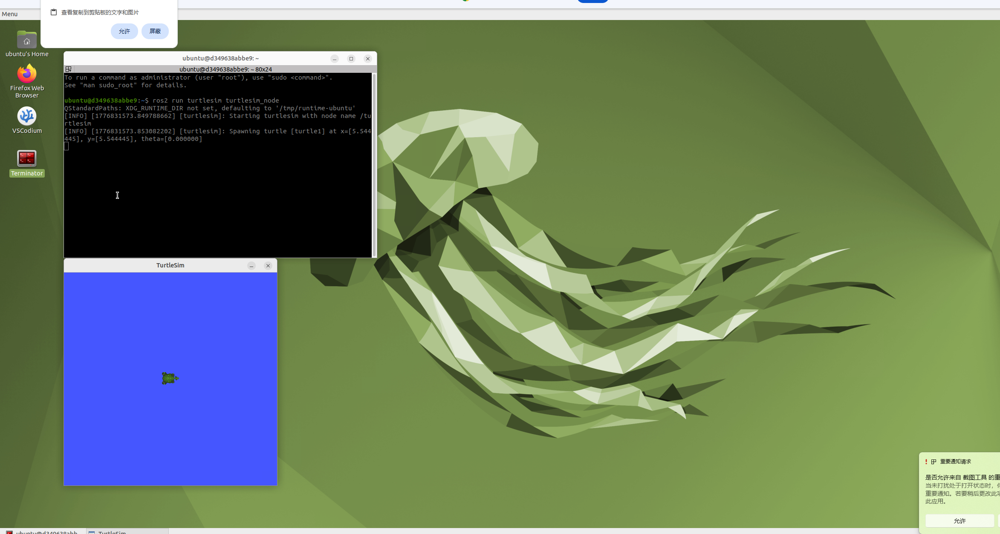

## week8 安装docker 并且成功运行小乌龟程序  
1. 下载安装docker powell shell 管理员权限运行 &install.exe 安装完会切换用户  
2. github访问 https://github.com/Tiryoh/docker-ros2-desktop-vnc 运行 powell shell 管理员权限运行 docker run -p 6080:80 --security-opt seccomp=unconfined --shm-size=512m ghcr.io/tiryoh/ros2-desktop-vnc:humble
3. 安装完成后 访问 http://127.0.0.1:6080/ 出现可视化乌班图界面 在界面中打开 powell shell 运行小乌龟 ros2 run turtlesim turtlesim_node
效果图  
