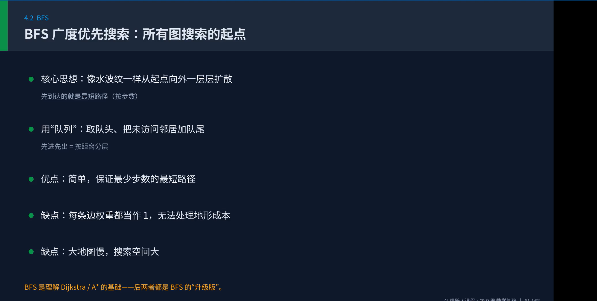

## Week9 机器人与机器视觉  
向量/矩阵/坐标变换.SO(3)/SE(3)/四元数  
 
机器人要在三维物理世界里运动  
位置、姿态、速度、力——全部是数学对象  
感知：相机/激光把世界变成矩阵与点云  
卷积、梯度、投影都是线性代数运算
决策：从A到B怎么走  
路径规划＝图搜索+采样+优化 

向量与坐标系：描述空间的最小单位  
向量=既有大小又有方向的量  
机器人里：位置、速度、力、角速度都是向量  
坐标系=度量世界的参照框架  
世界系/机体系/相机系/关节系  
同一个点，在不同坐标系下数值不同  
坐标变换的本质就是“换参照系”  
向量运算是后面一切的基础  
点积、叉积、模长、线性组合  
正运动学.逆运动学.雅可比矩阵  
逆运动学：已知末端位置，求关节角  
输入末端(x,y)→输出关节角(01,02)  
反向求解，是控制机械臂的关键  
可能有多个解  
手肘向上/手肘向下  
可能无解  
目标超出工作空间  
可能有无穷多解  
冗余机械臂 自由度>任务维度  
图像表示.卷积.特征提取.相机成像  
卷积：计算机视觉与深度学习的核心运算  
卷积=滑动窗口×加权求和  
把卷积核放到图像上，对应元素相乘再求和。移动核，遍历整张图，得到特征图out=工（窗口×核)  
这正是CNN第一层在做的事  
不同的核提取不同特征  

